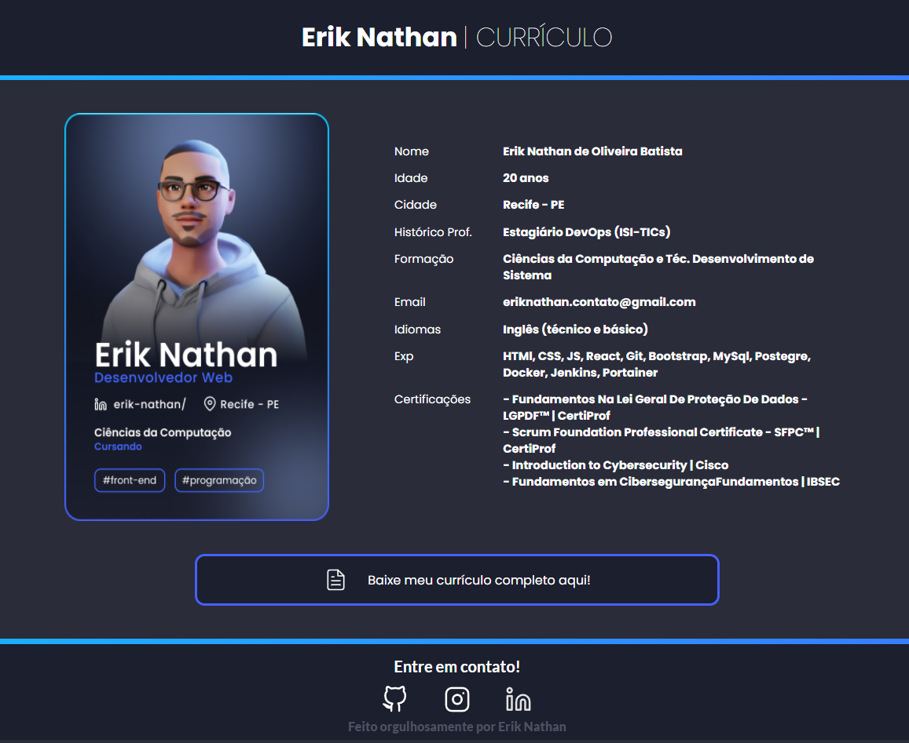

<h1 align="center"> Landing Page | Currículo 📃</h1>

  <a href="#-grupo">Squad</a>&nbsp;&nbsp;&nbsp;|&nbsp;&nbsp;&nbsp;
  <a href="#-tecnologias">Tecnologias</a>&nbsp;&nbsp;&nbsp;|&nbsp;&nbsp;&nbsp;
  <a href="#-projeto">Projeto</a>&nbsp;&nbsp;&nbsp;|&nbsp;&nbsp;&nbsp;
  <a href="#-layout">Layout</a>&nbsp;&nbsp;&nbsp;|&nbsp;&nbsp;&nbsp;
  <a href="#memo-licença">Licença</a>

 
 

  

## 👨🏽‍🦱 | **Desenvolvido** por

- Erik Nathan de Oliveira Batista [Minha Bio](https://links-eriknathan.netlify.app/)

## 🚀 | Tecnologias

Esse projeto foi desenvolvido com as seguintes tecnologias:

**FRONT-END**     

- HTML
- CSS
- JavaScript

**DSIGN**

- Figma

## 💻 | Projeto

Atividade de Desenvolvimento Web para desenvolver uma Landing Page usando HTML e CSS em dupla ou solo para criação de um Currículo! 😉

## 🔖 | Layout

Você pode visualizar o layout do projeto através [desse link](https://www.figma.com/embed?embed_host=notion&url=https%3A%2F%2Fwww.figma.com%2Ffile%2FoI8SnG5YnzwRf3TZelxnKP%2FUI-Design---Erik-Nathan%3Fnode-id%3D105%253A2). É necessário ter conta no [Figma](https://figma.com) para acessá-lo

## :memo: Licença

Esse projeto está sob a licença MIT. Veja o arquivo [LICENSE](LICENSE.md) para mais detalhes.

---
